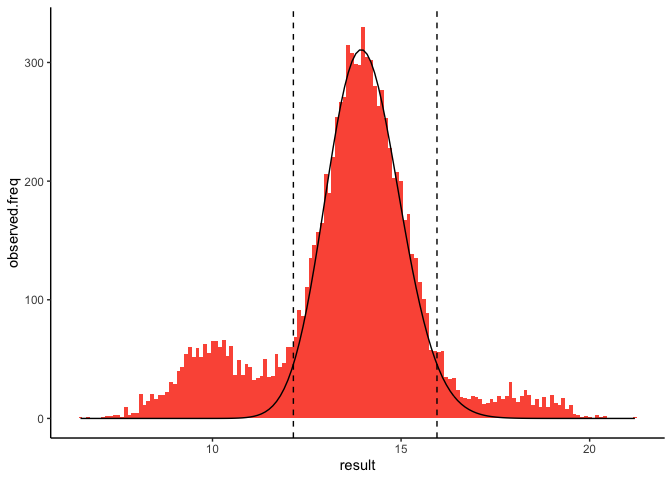

<!-- README.md is generated from README.Rmd. Please edit that file -->

# kosmic

<!-- badges: start -->
<!-- badges: end -->

This repository contains R bindings for Kosmic, a C++ library that can
estimate reference intervals from routinely collected laboratory data.
It does this by fitting a normal distribution to the central part of the
observerved data. The [original C++
library](https://gitlab.miracum.org/kosmic/kosmic) was written by Jakob
Zierk and others.

## Installation

The R bindings for Kosmic are still under development. You can install
the development version from GitHub.

``` r
# install.packages("devtools")
devtools::install_github("divinenephron/kosmic-r")
```

## Example

This is a basic example which shows you how to solve a common problem:

``` r
library(kosmic)
k <- kosmic(haemoglobin$result, decimals = 1)
plot(k)
```



``` r
summary(k)
#> An estimated distribution of physiological results
#> with the following quantiles:
#>     2.5%    50.0%    97.5% 
#> 12.14464 13.94471 15.95217
```
